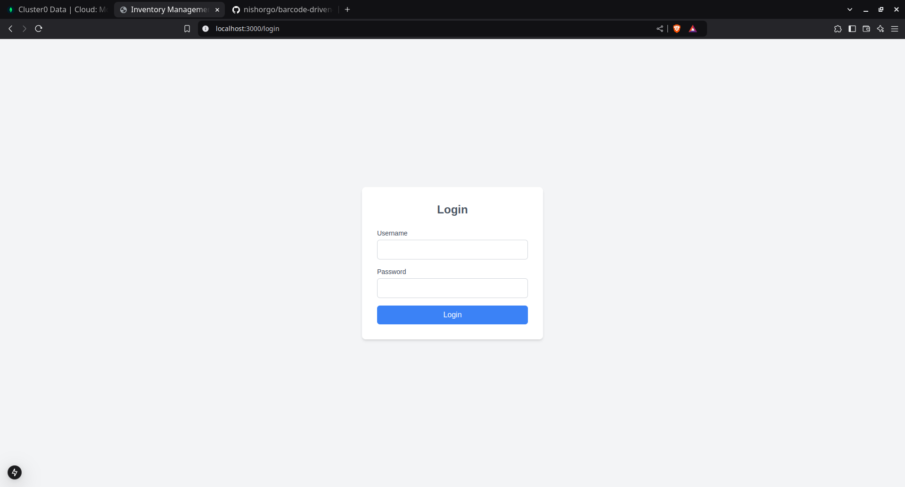
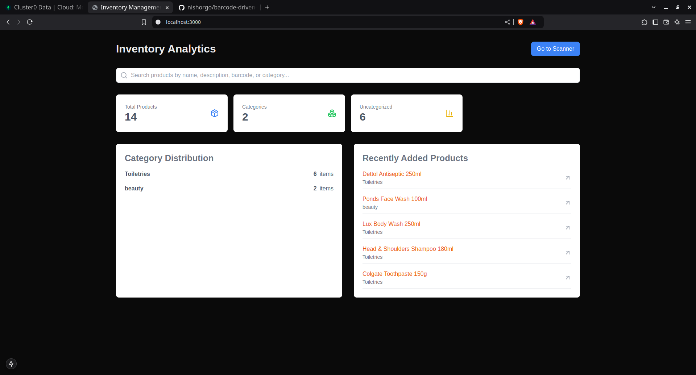
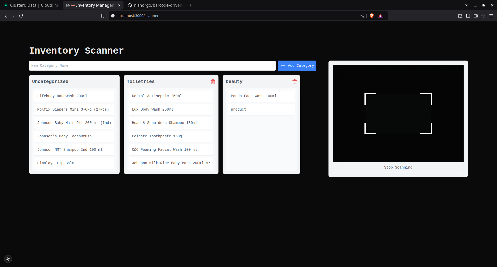

# Inventory Management System

## Overview
This project is an Inventory Management System designed to help users efficiently track and manage their inventory. It features a barcode scanner for easy product addition, a Kanban board for product categorization, and an analytics dashboard for insights into inventory status. Although I didn't get enough time to implement a complete login system, a basic authentication system ensures secure access to the application. I thoroughly enjoyed the challenge of implementing such a system within a short timeframe. Here is a demo video of the application in action: 

## Project Structure
The project is structured as follows:
- `client`: Contains the frontend code for the application, built with Next.js and TypeScript.
- `api`: Contains the backend code for the application, built with Node.js and Express.js. It includes a GraphQL API for data management and authentication.
- `screenshots`: Contains screenshots of the application in various stages of development.

## Tools and Libraries
The project uses the following tools and libraries:
   - **Frontend**: Next.js (App Router) with TypeScript for a modern, scalable web application structure.
   - **Backend**: Node.js with Express.js for a robust server-side framework.
   - **Database**: MongoDB for storing and retrieving data.
   - **GraphQL**: Apollo Server for building a powerful GraphQL API.
   - **Drag and Drop**: hello-pangea/dnd library for implementing drag-and-drop functionality in the Kanban board.
   - **Barcode Scanning**: html5-qrcode for integrating barcode scanning capabilities.
   - **HTTP Requests**: axios for making API calls to the backend.
   - **Styling**: Tailwind CSS for a responsive and customizable UI.

   These tools were chosen for their performance, community support, and ease of use, making development more efficient and the application more maintainable.

## Setup Instructions
To set up the project locally, follow these steps:
1. **Clone the Repository**:
   ```bash
   git clone <repository-url>
   cd Inventory
   ```

2. **Install Dependencies**:
   Navigate to both the `client` and `api` directories and install the dependencies:
   ```bash
   cd client
   npm install
   cd ../api
   npm install
   ```

3. **Environment Variables**:
   Create a `.env` file in the `api` directory and add the necessary environment variables (database connection strings, MONGODB_URI is mandatory).

4. **Run the Application**:
   Start the backend server:
   ```bash
   cd api
   npm start
   ```
   Then, in a new terminal, start the frontend application:
   ```bash
   cd client
   npm run dev
   ```

5. **Access the Application**:
   Open your browser and navigate to `http://localhost:3000` to view the application.

## Screenshots
- **Login Page**: 
- **Dashboard**: 
- **Kanban Board**: 

## Conclusion
This README provides a comprehensive overview of the Inventory Management System, detailing the tools used, setup instructions, and insights into the project's design and functionality. For any further questions or contributions, please refer to the project's documentation or contact the project maintainers.